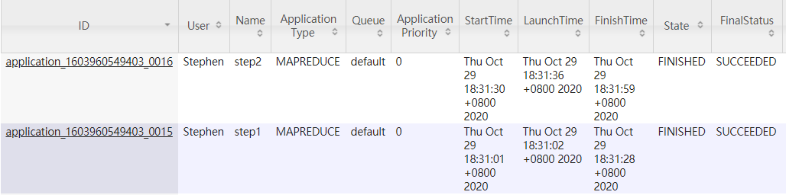

#

## 说明

**思路：** 分俩次MapReduce做（一次也可以，后边会进行对比分析）

第一阶段map，输出<朋友，人>，

第一阶段 Reduce 对所有传过来的<朋友，list(人)>进行拼接，输出<朋友,拥有这名朋友的所有人>；

第二阶段Mapper 将第一阶段产生的数据作为原数据

 1.将上一阶段reduce输出的<朋友,拥有这名朋友的所有人>信息中的“拥有这名朋友的所有人”进行排序 ，以防出现B-C C-B这样的重复，也能保证最后的输出是按顺序的。

 2.将“拥有这名朋友的所有人”进行两两配对，并将配对后的字符串当做键，“朋友”当做值输出，即输出<人-人，共同朋友>

 第二阶段的reduce <人-人，list(共同朋友)> 中的“共同好友”进行拼接 最后输出<人-人，两人的所有共同好友>

**运行方式：** 控制台输入：bin/hadoop jar share/homework6-1.jar mutualfriend.mutualfriend input output

通过 bin/hdfs dfs -cat output/* 查看结果

同时我将结果保存在了output/result.txt中

运行成功的WEB页面截图如下：（共俩次job,step1和step2）

## 总结分析

* StringBuffer是一个可变对象,当对他进行修改的时候不会像String那样重新建立对象，用于value的组合很方便。
* 定义map和reduce类的时候必须要 public static，否则会找不到方法报错。
* 还有一种解题思路是只用一次MapReduce，也是很容易想到的：key为两两用户，value为其中一个用户的所有好友，然后求两个用户所有好友的交集。步骤为：1、map：取每一行，组合user和其任一好友为key（key中的两个字段按字典序排列），user的所有好友为value  2、reduce：求两个用户之间好友的交集。需要自己定义一个找交集的函数，代码的复杂度比俩次MapReduce较复杂一点，但整体上相差不大。效率上对比，由于其涉及集合的取交集，可能效率稍低，但由于数据量太小，没有实际比较效果。
