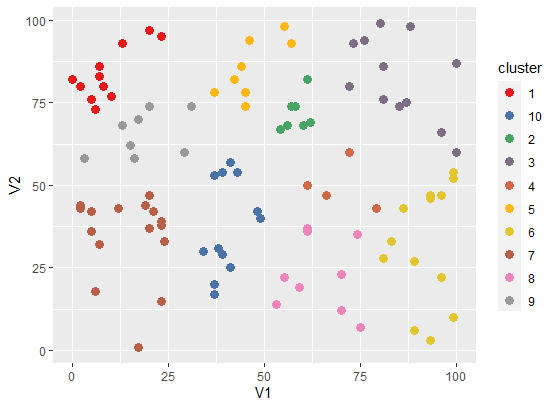
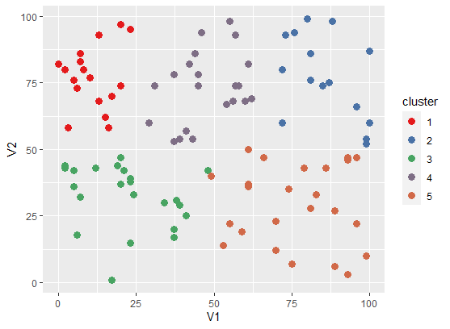
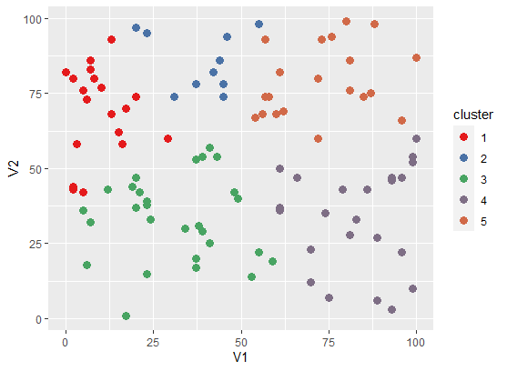

# 作业七 KMeans算法

## 输入文件

（本实验使用的是二维数据，代码支持任意维度的数据作为输入） 
格式如下: 
86,43  
5,36  
16,58  
每行一个实例。

## 运行
输入参数： 
k: 簇中心数 
iteration num: 迭代数 
input path: 输入路径  
output path: 输出路径 
 打包成jar后，运行：<  br/>
> hadoop jar homework7-kmeans.jar kmeans.KMeansDriver <k\> <iteration num\> <input path\> <output path\>

 例：bin/hadoop jar share/homework7-kmeans.jar kmeans.KMeansDriver 10 5 input output

## 程序说明
整个程序是在黄老师的代码基础上进行调整和修改的。主要分为以下几个核心类： 

* KMeansDriver.java负责调度整个KMeans运行的过程，包括控制台命令的读取；
* KMeans.java是KMeans聚类算法，定义了KMeansMapper，KMeansCombiner，KMeansReducer三个核心函数
* Cluster.java定义了簇这个重要的类，主要包含clusterID，numOfPoints，center三个重要变量，以及设定值得相关函数
* Instance.java定义了一个实例的类，即一个多维的点
* KMeansCluster.java主要定义了KMeansClusterMapper这一个map函数，用于KMeansClusterJob，这是最后一次MapReduce程序，其没有reduce，直接将map结果输出到文件中，作用是确定距离每个点最近的簇。
* RandomClusterGenerator.java用于程序的初始化，即随机选取k个点作为簇的初始点。
* king文件夹下定义了对于距离的计算类，主要用的是欧几里得距离算法，EuclideanDistance.java及其继承的Distance.java

i次迭代共进行i次clusterCenterJob和一次KMeansClusterJob，共i+1次MapReduce过程。clusterCenterJob用于确定每个簇（包括其中的点的个数和簇的中心），每次迭代都会输出当次迭代的各个簇的信息，KMeansClusterJob用于确定每个点属于哪个簇。

## 输出结果说明

最终结果保存**clusterResult.txt**和**clusteredInstances.txt**中 
**clusterResult.txt**中的数据为每个簇的信息，每一行的数据表示为： 
（由于输入是二维数据，故结果也为二维，多维的数据也可以处理，结果对应为多维） 
NoCluster,PointNum,v1,v2  
每一行为一个簇，NoCluster为簇id，PointNum为这个簇里的点的个数，v1,v2为簇中心对应的维度坐标。 
**clusteredInstances.txt**中的数据为每个点所在的簇。 
每一行数据为：实例,簇id 
由于设置不同的K值和迭代次数，文件以后缀ki来加以区别，如10个簇迭代次：clusterResult_k10i5.txt,clusteredInstances_k10i5.txt
 

## 可视化结果展示

我使用的是r语言实现可视化效果，使用的方法是**不同簇的点不同着色**来区别所属的簇。相关代码为RScript/drawKmeans.r 

#### 10个簇迭代5次

#### 5个簇迭代5次

#### 5个簇迭代3次

### 结果比较
因为示例中的100个点是随机分布的，所以聚类没有本质上的优劣之分，分的簇的个数也是没有合不合理区别的，但可以看出随着迭代次数的增加，点的聚类效果相对更好一点。

