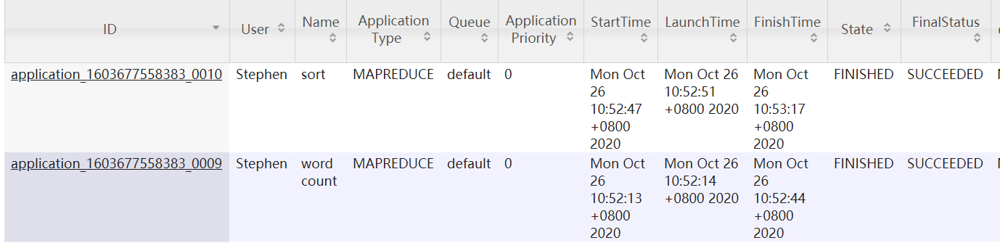

## 实现重点说明

**忽略停词：** 新建立函数private void wordSkipFile用来剔除停词和数字，保存在集合wordsToSkip中，在map之前判断word是否在wordsToSkip集合中，不在集合中的的进入map。

**忽略数字：** 我是新加了一个number.txt 内容是one,two...常见的数字

**从大到小排列：** 利用hadoop自带的排序功能，只需要定义一个用于排序比较的静态内部类，通过这个类来控制词频统计最后的排序结果。我使用的静态内部类是IntWritableDecreasingComparator，并在main函数中主动声明使用这个比较器。即做俩次MapReduce，第一个job为wordcount，结果存放在零时文件夹中，同时此文件夹作为第二个job（sortjob）的输入文件夹，sort完成后存放结果到result文件夹中

**输出前100个高频单词和输出格式设置：** 自定义一个selfReducer类作reduce和输出设定，通过count计数实现输出前100个，更改key为count + ":" +v.toString() + ',' +key.toString() ;value为NullWritable类型实现各式的要求。同时用sortJob.setMapperClass(InverseMapper.class)将reducer的个数限定为1。

## 结果展示
结果存放在output下的result.txt文件中

打包的jar包为：test1-test1.jar

命令行运行方式为：bin/hadoop jar share/test1-test1.jar test1.WordCount -D wordcount.case.sensitive=false input output4 -skip patterns/punctuation.txt patterns/stop-word-list.txt patterns/number.txt

运行成功的WEB页面截图如下：（共俩次job，一次wordcount，一次sort）

### 可改进处分析
* 现在使用自定义的reducer来实现输出格式的限定，但这样其实是有一定局限性的，难以实现较复杂的输出格式，最好的方法是重写FileOutputFormat类，可以实现更为复杂的输出格式。
  
